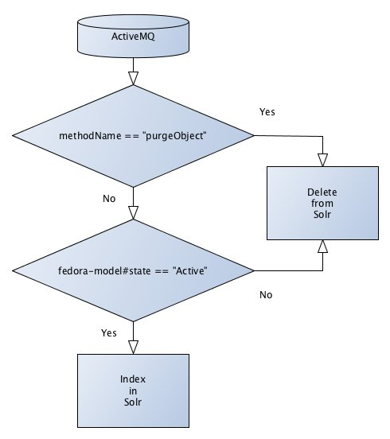

## Introduction

This document covers the ways Fedora information gets into Solr.

There are 3 main parts to Solr indexing.
* Fedora
* FedoraGSearch
* Solr

All three of these parts are (normally) located in your Tomcat container. The standard locations are
* Fedora - http://&lt;servername&gt;:8080/fedora
* FedoraGSearch - http://&lt;servername&gt;:8080/fedoragsearch
& Solr - http://&lt;servername&gt;:8080/solr

## The workflow

When an object is added/edited/deleted in Fedora the repository emits a [JMS message][1] it uses an internal ActiveMQ broker that Fedora provides to hold that message.

ActiveMQ has queues and topics, which you have configured is setup in your `$FEDORA_HOME/server/config/fedora.fcfg`. More information about them is available [here][2].

The message looks like this:
```xml
<?xml version="1.0" encoding="UTF-8"?>
<entry xmlns="http://www.w3.org/2005/Atom" xmlns:xsd="http://www.w3.org/2001/XMLSchema" xmlns:fedora-types="http://www.fedora.info/definitions/1/0/types/">
  <id>urn:uuid:4ea71518-9ff7-4cfe-8aac-ecaf02e2b709</id>
  <updated>@lastMod</updated>
  <author>
    <name>fedoraAdmin</name>
    <uri>http://servername:8080/fedora</uri>
  </author>
  <title type="text">modifyDatastreamByReference</title>
  <category term="islandora:123" scheme="fedora-types:pid" label="xsd:string"></category>
  <category term="OBJ" scheme="fedora-types:dsID" label="xsd:string"></category>
  <category term="" scheme="fedora-types:altIDs" label="fedora-types:ArrayOfString"></category>
  <category term="null" scheme="fedora-types:dsLabel" label="xsd:string"></category>
  <category term="null" scheme="fedora-types:formatURI" label="xsd:string"></category>
  <category term="null" scheme="fedora-types:dsLocation" label="xsd:string"></category>
  <category term="null" scheme="fedora-types:checksumType" label="xsd:string"></category>
  <category term="null" scheme="fedora-types:checksum" label="xsd:string"></category>
  <category term="null" scheme="fedora-types:logMessage" label="xsd:string"></category>
  <summary type="text">islandora:123</summary>
  <content type="text">@lastMod</content>
  <category term="3.7.0" scheme="info:fedora/fedora-system:def/view#version"></category>
  <category term="info:fedora/fedora-system:ATOM-APIM-1.0" scheme="http://www.fedora.info/definitions/1/0/types/formatURI"></category>
</entry>
```

It can contain a lot of information, but usually doesn't. It also will have a header for "pid" and "methodName".

The pieces of information used are:

* The "pid" header and the `<category scheme="fedora-types:pid"/>` contains the PID of the object.
* The "methodName" header and the `<title/>` element contain the action, some values are
    * ingest
    * modifyDatastreamByReference
    * purgeObject
    * addDatastream
* The `<category scheme="fedora-types:dsId"/>` contains the datastream ID (if applicable)

FedoraGSearch is listening to the ActiveMQ queue and when a message comes in it starts to work. It uses the following workflow to determine whether to index the object to Solr or delete it from the Solr index.



Basically if the object **is not** being deleted and **is** Active then index it.

If we are indexing then FedoraGSearch parses the foXML file and based on your specific stylesheets, generates a Solr [XML update document][3].

Then this XML document is sent to Solr which will add it new if the PID (which is used as the unique ID) doesn't exist, if it does then the existing record is updated.

Your Solr index contains an updated representation of your object.


[1]: https://docs.oracle.com/cd/E19798-01/821-1841/bnces/index.html
[2]: http://activemq.apache.org/how-does-a-queue-compare-to-a-topic.html
[3]: https://wiki.apache.org/solr/UpdateXmlMessages